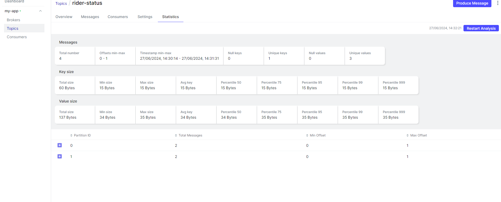
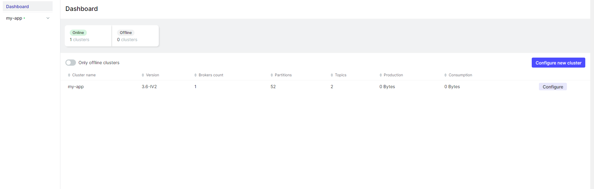
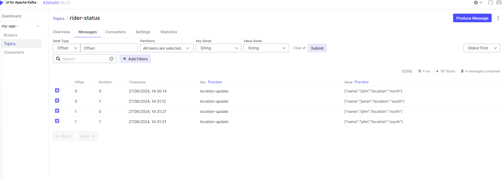

# KAFKA is widely used across various industries for building real-time data pipelines, event-driven architectures, and streaming applications.

## An application demonstrate the fundamental of Apache Kafka using KafkaJS NPM Package where producer create message upon delivery from driver with partition either north or south. With two consumers messages will be distributed in designated partition with load balancing too.

## Installation

    # Download or clone repository
    # NodeJS and Docker is required to run the application.
    # Update you IP address in client.js

## commands to run the application

    # CD into the directory and run the below commands one by one
    # docker compose up -d (to initialize the docker containers to run Kafka)
    # node admin.js ( to create topic, partition number)
    # node producer.js (to create the messages)
    # node consumer.js user-1 (to consume the messages)
    # additionally you can open up new terminal and run above command to see the message partition.
    # open up browser and run http://localhost:8080 for the Kafka UI

## Please feel free to contact should you run into any errors

# IMAGES

